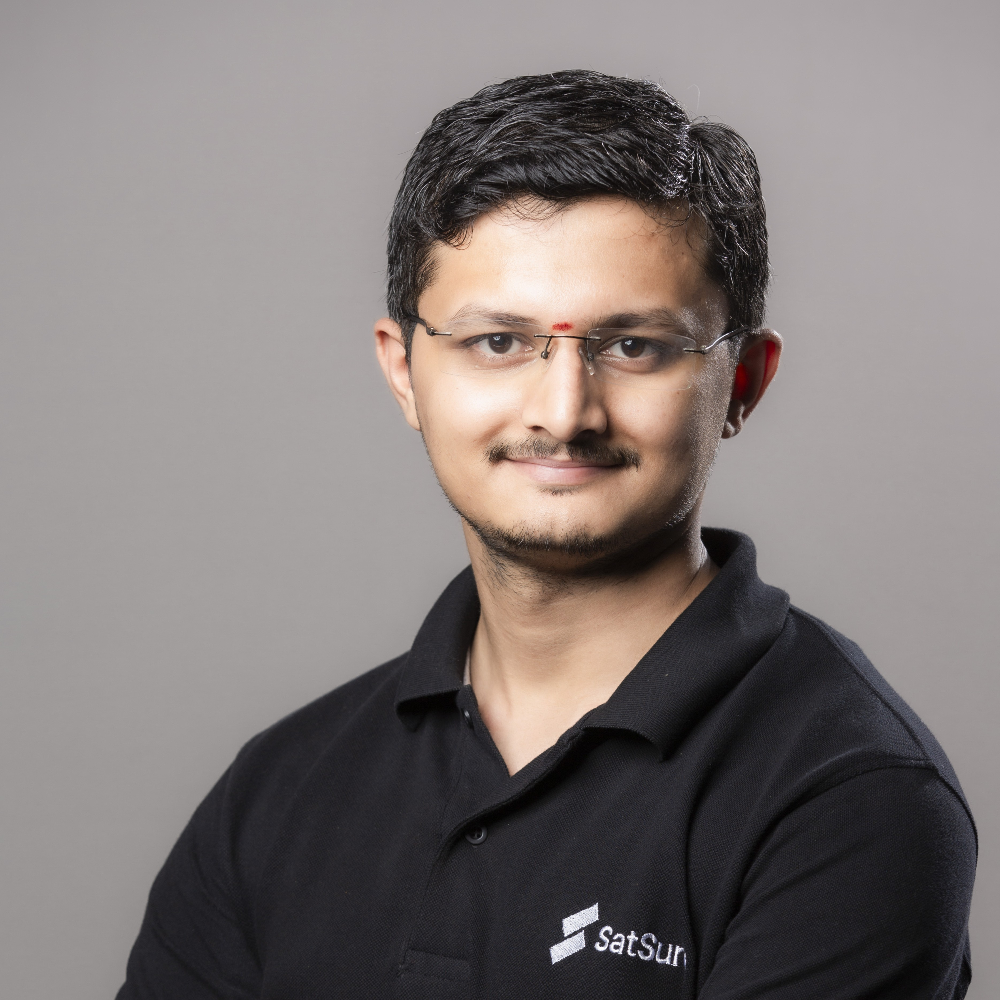

---
hide:
  - toc
  - navigation
---
<!--
CHECKLIST FOR THIS PAGE:
- [ ] Replace [YOUR NAME] with your full name (3 places)
- [ ] Replace [YOUR JOB TITLE] with your current or target role
- [ ] Replace [YOUR TAGLINE] with a short phrase describing your focus
- [ ] Rewrite the About Me paragraph with your own words
- [ ] Replace assets/images/profile.png with your actual photo (keep the filename or update it below)
- [ ] Replace assets/images/about.png with your own image (a field photo, map, or workspace shot)
- [ ] Edit the skill cards to match your actual skills (add, remove, or rename cards as needed)
- [ ] Update GitHub and LinkedIn links in the Connect section
- [ ] Add your CV PDF to docs/assets/ and update the filename in the Download CV button
-->

  
  <h1>Bhuvanamitra S</h1>
  
<strong>Geospatial Data Analyst | Team Lead </strong>

  
<em>Turning GeoData to Geo-enabled Insights</em>

---

## About Me

Geospatial Manager and Remote Sensing Specialist with 6+ years of hands-on experience delivering end-to-end GIS solutions, satellite data analytics, and spatial intelligence products across agriculture, environmental monitoring, and aviation domains. Proven ability to build and lead cross-functional teams, manage full project lifecycles using Agile methodologies, and translate complex spatial data into actionable client deliverables. Experienced in QGIS, Python assisted automation, and multi-spectral satellite analysis. Adept at stakeholder coordination, sprint planning, delivery tracking, and documentation using Jira and Confluence. Track record of driving GIS product development, quality 
assurance, and on-time delivery across multidisciplinary programs. 

  

---

[View My Projects :material-arrow-right:](projects/index.md){ .md-button .md-button--primary }
[Download CV :material-download:](assets/Bhuvanamitra-CV.pdf){ .md-button }

---

## Skills

-   :material-layers:{ .lg .middle } **GIS & Remote Sensing**

    ---

    - QGIS,  Google Earth Engine
    - GDAL / OGR, GRASS GIS
    - Multispectral and High Resolution Analysis

-   :material-code-braces:{ .lg .middle } **Programming (AI Assisted)**

    ---

    - Python — GeoPandas, NumPy, Pandas, Matplotlib
    - R — sf, terra, ggplot2
    - JavaScript — Leaflet, MapLibre GL
    - SQL, PostgreSQL + PostGIS

-   :material-earth:{ .lg .middle } **Web Mapping & Data**

    ---

    - Leaflet.js, Folium, MapLibre GL JS
    - Cloud storage — AWS S3, Google Cloud Storage
    - Data formats — GeoTIFF, GeoParquet, NetCDF
    - Streamlit for data-driven web apps

-   :material-database:{ .lg .middle } **Data & Cloud**

    ---

    - PostgreSQL + PostGIS
    - Cloud storage: AWS S3, Google Cloud Storage
    - Data formats: GeoJSON, GeoTIFF, NetCDF, Zarr, GeoParquet

-   :material-airplane:{ .lg .middle } **GIS for Aviation**

    - Obstacle Analysis and eTOD as per ICAO Standards
    - Aerodrome Mapping Database
    - Flight Procedure Design Tool development

---

## Connect

[GitHub](https://github.com/[YOUR-GITHUB-USERNAME]){ .md-button }
[LinkedIn](https://linkedin.com/in/[YOUR-LINKEDIN-USERNAME]){ .md-button }
